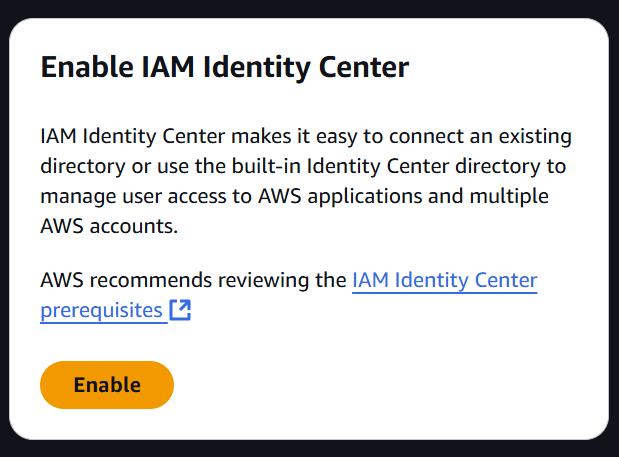

### Plan

Plan is to get [AWS Certificates](https://aws.amazon.com/certification/) and at the same time:
- do all practicing and testing in code or cli (or as much as possible)
- update this blog with experiences/things learned
- get better at markdown, python, aws cli, etc

### Root Credentials

AWS makes it clear that credentials for root account are not recommended. 


This makes sense, but we can not use `aws cli` without active credentials. Once we have the credentials, it will be possible to create new admin user and use that accounts credentials instead of root's.

So we generate them and stick them in `.aws\credentials` file.

```bash
iwidlinski@DESKTOP-REPDB09:~/.aws$ ls
config  credentials
iwidlinski@DESKTOP-REPDB09:~/.aws$ 
```
It works.

```bash
iwidlinski@DESKTOP-REPDB09:~/.aws$ aws sts get-caller-identity
{
    "UserId": "04771x",
    "Account": "04771x",
    "Arn": "arn:aws:iam::04771x:root"
}
iwidlinski@DESKTOP-REPDB09:~/.aws$ 
```

### Enable aws cli command completion

As per [aws documentation](https://docs.aws.amazon.com/cli/latest/userguide/cli-configure-completion.html). I never used it but lets try it.

Turns out that its pretty easy to turn this feature on.

```bash
complete -C '/usr/local/bin/aws_completer' aws
```

and now pressing *tab* displays a list of options

```bash
iwidlinski@DESKTOP-REPDB09:~/.aws$ aws dynamodb delete-table --
--ca-bundle              --cli-read-timeout       --no-cli-pager           --query
--cli-auto-prompt        --color                  --no-paginate            --region
--cli-binary-format      --debug                  --no-sign-request        --table-name
--cli-connect-timeout    --endpoint-url           --no-verify-ssl          --version
--cli-input-json         --generate-cli-skeleton  --output                 
--cli-input-yaml         --no-cli-auto-prompt     --profile 
```


### Command completiong vs command prompt
Turns out `aws cli v2` has a [command prompt](https://docs.aws.amazon.com/cli/latest/userguide/cli-usage-parameters-prompting.html) which looks very much like command completion, but it is built into the cli...

Will stick with command completion for now, not too sure which one is best.

### Enable IAM Identity Center - organization

I have no idea how to enable this in CLI/SDK/Boto so for the sake of saving time, I'll enable the organization instance of Identiy Center using the AWS Console...

