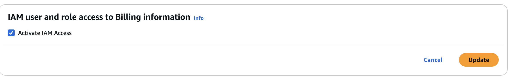

### Enabling IAM access to Billing
According to [this post](https://stackoverflow.com/a/69248558) giving [IAM access to Billing Console](https://docs.aws.amazon.com/awsaccountbilling/latest/aboutv2/control-access-billing.html#ControllingAccessWebsite-Activate) can only be done through console.

So lets enable it.

