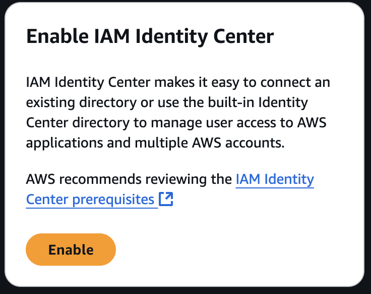

As mentioned [initially here]() I was having trouble finding a way to enable [organization instance of Identity Center]("https://docs.aws.amazon.com/singlesignon/latest/userguide/organization-instances-identity-center.html") using some form of automated way ( either through aws cli, or cdk, or whatever). 

Back then, I did not enable it, hoping I could find a way to do it using code. Since then, i've spent some time researching this, and I found some documents ( which I lost...) that seemed to imply this can only be enabled manually using the AWS Console. So going to do this now.



It worked:
```
igorwidlinski@mac ~ % aws sso-admin list-instances
{
    "Instances": [
        {
            "CreatedDate": "2025-02-01T08:04:24.378000-08:00",
            "IdentityStoreId": "d-92679e2402",
            "InstanceArn": "arn:aws:sso:::instance/ssoins-790726f27b17ca0c",
            "OwnerAccountId": "047719662517",
            "Status": "ACTIVE"
        }
    ]
}
```